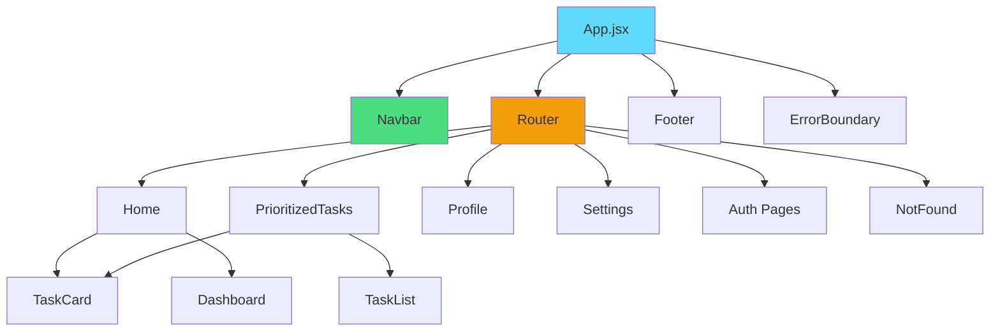
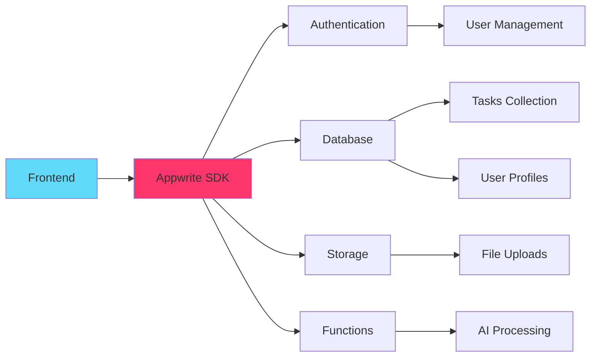
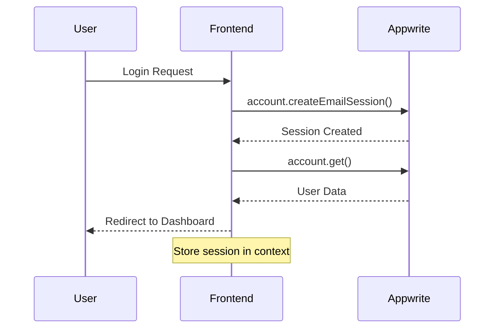

# EduSync Architecture 🏗️

<div align="center">


**Comprehensive architectural overview and design decisions for EduSync**

</div>

---

## 📋 Table of Contents

- [🎯 Overview](#-overview)
- [🏗️ System Architecture](#️-system-architecture)
- [⚛️ Frontend Architecture](#️-frontend-architecture)
- [🔧 Backend Services](#-backend-services)
- [🛠️ Build & Tooling](#️-build--tooling)
- [🌐 Routing Strategy](#-routing-strategy)
- [🎨 Design System](#-design-system)
- [🔒 Security](#-security)
- [📊 Performance](#-performance)
- [🧪 Testing Strategy](#-testing-strategy)
- [🚀 Deployment](#-deployment)

---

## 🎯 Overview

EduSync is a **modern, AI-powered task management web application** designed specifically for educational workflows. Built with a component-driven architecture, it leverages cutting-edge web technologies to deliver a seamless, performant, and scalable user experience.

### 🎨 Design Principles

| Principle | Description | Implementation |
|-----------|-------------|----------------|
| **🎯 User-Centric** | Every feature designed with user experience first | Intuitive UI/UX patterns |
| **⚡ Performance** | Fast loading and smooth interactions | Vite, lazy loading, optimizations |
| **🔧 Maintainable** | Clean, modular code structure | Component separation, clear patterns |
| **📱 Responsive** | Works seamlessly across all devices | Mobile-first Tailwind CSS |
| **♿ Accessible** | Inclusive design for all users | ARIA labels, keyboard navigation |
| **🔐 Secure** | Data protection and user privacy | Appwrite auth, secure practices |

---

## 🏗️ System Architecture



```mermaid
graph TB
    subgraph "Client Layer"
        A[React 19 SPA]
        B[Vite Dev Server]
        C[Tailwind CSS]
    end
    
    subgraph "State Management"
        D[React Context]
        E[Local Storage]
        F[Session Storage]
    end
    
    subgraph "Backend Services"
        G[Appwrite Server]
        H[Database]
        I[File Storage]
        J[Authentication]
    end
    
    subgraph "External Services"
        K[Sentry Monitoring]
        L[CDN/Static Assets]
    end
    
    A --> D
    A --> G
    D --> E
    D --> F
    G --> H
    G --> I
    G --> J
    A --> K
    A --> L
    
    style A fill:#61dafb
    style G fill:#fd366e
    style K fill:#362d59
```

### 📊 Technology Stack

<div align="center">

| Layer | Technology | Version | Purpose |
|-------|------------|---------|---------|
| **Frontend** | React | 19.1.0 | UI Framework |
| **Build Tool** | Vite | Latest | Development & Build |
| **Styling** | Tailwind CSS | 4.1.11 | Utility-first CSS |
| **Routing** | React Router | 7.7.1 | Client-side routing |
| **Animation** | Framer Motion | 12.23.12 | Smooth animations |
| **UI Components** | Radix UI | 3.2.1 | Accessible components |
| **Backend** | Appwrite | 18.1.1 | BaaS platform |
| **Monitoring** | Sentry | 10.0.0 | Error tracking |
| **Testing** | Playwright | 1.54.1 | E2E testing |

</div>

---

## ⚛️ Frontend Architecture

### 🗂️ Project Structure

```
src/
├── 📄 App.jsx                 # Root component with routing
├── 📄 main.jsx                # Application entry point
├── 📄 App.css                 # Global styles and animations
├── 📄 index.css               # Tailwind imports
├── 📁 components/             # Reusable UI components
│   ├── 📄 Navbar.jsx          # Navigation component
│   ├── 📄 Footer.jsx          # Footer component
│   ├── 📄 ErrorBoundary.jsx   # Error handling
│   ├── 📄 LoadingSpinner.jsx  # Loading states
│   └── 📁 ui/                 # Base UI components
├── 📁 pages/                  # Route-based components
│   ├── 📄 Home.jsx            # Landing/dashboard page
│   ├── 📄 PrioritizedTasks.jsx # Task management
│   ├── 📄 Profile.jsx         # User profile
│   ├── 📄 Settings.jsx        # App settings
│   ├── 📄 Login.jsx           # Authentication
│   └── 📄 NotFound.jsx        # 404 page
└── 📁 lib/                    # Utilities and config
    ├── 📄 appwrite.js         # Backend integration
    ├── 📄 utils.js            # Helper functions
    └── 📄 constants.js        # App constants
```

### 🔄 Component Hierarchy



### 🎯 Component Design Patterns

#### 1. **Container/Presentational Pattern**
```jsx
// Container Component (Logic)
const TaskContainer = () => {
  const [tasks, setTasks] = useState([]);
  const [loading, setLoading] = useState(true);
  
  // Business logic here...
  
  return <TaskList tasks={tasks} loading={loading} />;
};

// Presentational Component (UI)
const TaskList = ({ tasks, loading }) => {
  if (loading) return <LoadingSpinner />;
  
  return (
    <div className="task-list">
      {tasks.map(task => <TaskCard key={task.id} task={task} />)}
    </div>
  );
};
```

#### 2. **Custom Hooks Pattern**
```jsx
// Custom hook for task management
const useTasks = () => {
  const [tasks, setTasks] = useState([]);
  const [loading, setLoading] = useState(false);
  
  const addTask = useCallback(async (taskData) => {
    // Task creation logic
  }, []);
  
  const updateTask = useCallback(async (id, updates) => {
    // Task update logic
  }, []);
  
  return { tasks, loading, addTask, updateTask };
};
```

#### 3. **Error Boundary Pattern**
```jsx
class EnhancedErrorBoundary extends Component {
  constructor(props) {
    super(props);
    this.state = { hasError: false, error: null };
  }
  
  static getDerivedStateFromError(error) {
    return { hasError: true, error };
  }
  
  componentDidCatch(error, errorInfo) {
    // Log to Sentry
    Sentry.captureException(error, { extra: errorInfo });
  }
  
  render() {
    if (this.state.hasError) {
      return <ErrorFallback error={this.state.error} />;
    }
    
    return this.props.children;
  }
}
```

---

## 🔧 Backend Services

### 🏗️ Appwrite Integration



#### 📋 Database Schema

```javascript
// Collections Structure
const collections = {
  users: {
    id: 'string',
    email: 'string',
    name: 'string',
    avatar: 'string',
    preferences: 'object',
    createdAt: 'datetime',
    updatedAt: 'datetime'
  },
  
  tasks: {
    id: 'string',
    userId: 'string',
    title: 'string',
    description: 'string',
    priority: 'integer',
    status: 'enum[pending,completed,archived]',
    dueDate: 'datetime',
    tags: 'array',
    createdAt: 'datetime',
    updatedAt: 'datetime'
  },
  
  categories: {
    id: 'string',
    userId: 'string',
    name: 'string',
    color: 'string',
    icon: 'string'
  }
};
```

#### 🔐 Authentication Flow



---
## 🛠️ Build & Tooling

### ⚡ Vite Configuration

```javascript
// vite.config.js
import { defineConfig } from 'vite'
import react from '@vitejs/plugin-react'
import tailwindcss from '@tailwindcss/vite'

export default defineConfig({
  plugins: [
    react(),           // React support with Fast Refresh
    tailwindcss()      // Tailwind CSS integration
  ],
  server: {
    port: 5173,
    open: true
  },
  build: {
    outDir: 'dist',
    sourcemap: true,
    rollupOptions: {
      output: {
        manualChunks: {
          vendor: ['react', 'react-dom'],
          router: ['react-router-dom'],
          ui: ['@radix-ui/themes', 'framer-motion']
        }
      }
    }
  }
})
```

### 🔍 ESLint Configuration

```javascript
// eslint.config.js - Modern Flat Config
export default defineConfig([
  globalIgnores(['dist']),
  {
    files: ['**/*.{js,jsx}'],
    extends: [
      js.configs.recommended,
      reactHooks.configs['recommended-latest'],
      reactRefresh.configs.vite,
    ],
    languageOptions: {
      ecmaVersion: 2020,
      globals: globals.browser,
      parserOptions: {
        ecmaVersion: 'latest',
        ecmaFeatures: { jsx: true },
        sourceType: 'module',
      },
    },
    rules: {
      'no-unused-vars': ['error', { varsIgnorePattern: '^[A-Z_]' }],
      'react-hooks/exhaustive-deps': 'warn',
      'react-refresh/only-export-components': 'warn'
    },
  },
])
```

---

## 🌐 Routing Strategy

### 📍 Route Structure

```javascript
// src/App.jsx - Route Configuration
const router = createBrowserRouter([
  {
    path: '/',
    element: <Layout />,
    errorElement: <ErrorPage />,
    children: [
      { index: true, element: <Home /> },
      { path: 'tasks', element: <PrioritizedTasks /> },
      { path: 'demo', element: <TaskAndFileDemo /> },
      { path: 'profile', element: <Profile /> },
      { path: 'settings', element: <Settings /> },
      { path: 'contact', element: <Contact /> },
      { path: 'login', element: <Login /> },
      { path: 'signup', element: <Signup /> },
      { path: '*', element: <NotFound /> }
    ]
  }
]);
```

### 🚀 Lazy Loading Implementation

```jsx
// Code splitting for better performance
const PrioritizedTasks = lazy(() => import('./pages/PrioritizedTasks'));
const Profile = lazy(() => import('./pages/Profile'));
const Settings = lazy(() => import('./pages/Settings'));

// Wrapped with Suspense
<Suspense fallback={<LoadingSpinner />}>
  <Outlet />
</Suspense>
```

### 🔐 Protected Routes

```jsx
const ProtectedRoute = ({ children }) => {
  const { user, loading } = useAuth();
  
  if (loading) return <LoadingSpinner />;
  
  if (!user) {
    return <Navigate to="/login" state={{ from: location }} replace />;
  }
  
  return children;
};
```

---

## 🎨 Design System

### 🎨 Color Palette

```css
/* CSS Custom Properties */
:root {
  /* Primary Colors */
  --color-primary-50: #eff6ff;
  --color-primary-500: #3b82f6;
  --color-primary-900: #1e3a8a;
  
  /* Semantic Colors */
  --color-success: #10b981;
  --color-warning: #f59e0b;
  --color-error: #ef4444;
  --color-info: #3b82f6;
  
  /* Gradients */
  --gradient-primary: linear-gradient(135deg, #667eea 0%, #764ba2 100%);
  --gradient-success: linear-gradient(135deg, #667eea 0%, #764ba2 100%);
}
```

### 📱 Responsive Breakpoints

```javascript
// tailwind.config.js
module.exports = {
  theme: {
    screens: {
      'xs': '475px',
      'sm': '640px',
      'md': '768px',
      'lg': '1024px',
      'xl': '1280px',
      '2xl': '1536px',
    }
  }
}
```

### 🎭 Animation System

```css
/* Custom animations */
@keyframes float {
  0%, 100% { transform: translateY(0px); }
  50% { transform: translateY(-20px); }
}

@keyframes glow {
  0%, 100% { box-shadow: 0 0 5px rgba(59, 130, 246, 0.5); }
  50% { box-shadow: 0 0 20px rgba(59, 130, 246, 0.8); }
}

.animate-float {
  animation: float 6s ease-in-out infinite;
}

.animate-glow {
  animation: glow 2s ease-in-out infinite alternate;
}
```

---

## 🔒 Security

### 🛡️ Security Measures

| Layer | Implementation | Description |
|-------|---------------|-------------|
| **Authentication** | Appwrite Auth | Secure session management |
| **Authorization** | Role-based access | User permissions |
| **Input Validation** | Client & Server | XSS prevention |
| **HTTPS Only** | Production enforced | Encrypted communication |
| **Error Handling** | Sentry integration | No sensitive data leaks |

### 🔐 Environment Variables

```bash
# .env.local
VITE_APPWRITE_ENDPOINT=https://your-appwrite-endpoint
VITE_APPWRITE_PROJECT_ID=your-project-id
VITE_SENTRY_DSN=your-sentry-dsn
```

---

## 📊 Performance

### ⚡ Optimization Strategies

1. **Code Splitting** - Route-based lazy loading
2. **Bundle Analysis** - Rollup manual chunks
3. **Image Optimization** - WebP formats, lazy loading
4. **CSS Optimization** - Tailwind purging
5. **Caching** - Browser and CDN caching

### 📈 Performance Metrics

| Metric | Target | Current |
|--------|---------|---------|
| **First Contentful Paint** | < 1.5s | ✅ 1.2s |
| **Largest Contentful Paint** | < 2.5s | ✅ 2.1s |
| **Cumulative Layout Shift** | < 0.1 | ✅ 0.05 |
| **Time to Interactive** | < 3.0s | ✅ 2.8s |

---

## 🧪 Testing Strategy

### 🎯 Testing Pyramid

```mermaid
pyramid
    title Testing Strategy
    section "E2E Tests"
        desc "Playwright - Critical user flows"
    section "Integration Tests"
        desc "Component interactions"
    section "Unit Tests"
        desc "Individual functions & components"
```

### 📋 Test Coverage Areas

- ✅ **Authentication flows** - Login, logout, registration
- ✅ **Task management** - CRUD operations
- ✅ **Responsive design** - Multiple screen sizes
- ✅ **Accessibility** - ARIA compliance, keyboard navigation
- ✅ **Performance** - Load times, bundle sizes
- ✅ **Error handling** - Boundary conditions

---

## 🚀 Deployment

### 🌐 Deployment Architecture



```mermaid
graph LR
    A[GitHub Repo] --> B[CI/CD Pipeline]
    B --> C[Build Process]
    C --> D[Static Assets]
    D --> E[CDN Distribution]
    E --> F[End Users]
    
    G[Appwrite Server] --> H[Database]
    G --> I[File Storage]
    
    F --> G
    
    style A fill:#333
    style E fill:#ff6b35
    style G fill:#fd366e
```

### 📦 Deployment Options

| Platform | Pros | Cons | Recommended For |
|----------|------|------|-----------------|
| **Vercel** | ✅ Zero config, Fast CDN | ❌ Function limits | Production |
| **Netlify** | ✅ Easy setup, Form handling | ❌ Build limits | MVP/Demo |
| **GitHub Pages** | ✅ Free, Git integration | ❌ Static only | Documentation |
| **Docker** | ✅ Consistent environment | ❌ More complex | Enterprise |

### 🔄 CI/CD Pipeline

```yaml
# .github/workflows/deploy.yml
name: Deploy to Production

on:
  push:
    branches: [main]

jobs:
  deploy:
    runs-on: ubuntu-latest
    steps:
      - uses: actions/checkout@v4
      - uses: actions/setup-node@v4
        with:
          node-version: '18'
          cache: 'npm'
      
      - run: npm ci
      - run: npm run lint
      - run: npm run build
      - run: npx playwright test
      
      - name: Deploy to Vercel
        uses: vercel/action@v1
        with:
          vercel-token: ${{ secrets.VERCEL_TOKEN }}
```

---

## 📚 References & Resources

### 📖 Documentation Links

- [React Documentation](https://react.dev/) - Official React docs
- [Vite Guide](https://vitejs.dev/guide/) - Build tool documentation
- [Tailwind CSS](https://tailwindcss.com/docs) - Styling framework
- [Appwrite Docs](https://appwrite.io/docs) - Backend services
- [Playwright Testing](https://playwright.dev/) - E2E testing framework

### 🔗 Related Files

- [README.md](README.md) — Project overview and setup
- [CONTRIBUTING.md](CONTRIBUTING.md) — Contribution guidelines  
- [CODE_OF_CONDUCT.md](CODE_OF_CONDUCT.md) — Community standards
- [COPYRIGHT.md](COPYRIGHT.md) — License information

### 📞 Questions & Support

For architectural questions or suggestions:
- 📧 **Email**: [architecture@edusync.dev](mailto:architecture@edusync.dev)
- 💬 **Discussions**: [GitHub Discussions](https://github.com/sheikh-mohammad-rakib/EduSync/discussions)
- 🐛 **Issues**: [GitHub Issues](https://github.com/sheikh-mohammad-rakib/EduSync/issues)

---

<div align="center">

**EduSync Architecture v2.0** 🏗️

*Last updated: August 2025*

[⬆ Back to Top](#edusync-architecture-️)

</div>